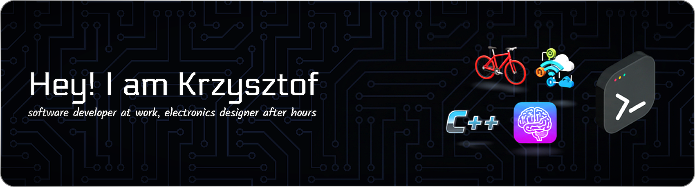

  

 &nbsp; 

Ever since I was a child, I’ve been captivated by computers. My programming journey began in elementary school, and after graduating from technical school, I devoted nearly a decade to game programming. Recently, I’ve shifted my focus toward automation testing and designing custom electronics.

  

## 📍 My Roots

I was born in **Bydgoszcz**, a vibrant city of approximately 354,000 residents (as of 2016) in northern Poland. While Bydgoszcz is nestled along the Brda River, my hometown lies on the banks of the Vistula River, Poland’s longest.

  

## 👀 What Inspires Me
- **PCB Design:** I love crafting and designing my own printed circuit boards.  
- **Game Development:** Creating immersive digital experiences remains a passion.  
- **Electrical Engineering:** I explore both the theoretical and practical aspects of electronics.  
- **Responsible AI:** I’m committed to understanding and applying artificial intelligence ethically and effectively.  

## 🌱 What I’m Learning
- Electronics design  
- Software architecture patterns  
- Modern C++ techniques  
- The Go programming language  
- Large language models  
- AI trends (ML technologies, LLMs, diffusion models, agents)  

## 💞️ Beyond Tech
- Staying active and healthy  
- Road cycling  
- Engaging in meaningful projects  

## 📫 Let’s Connect
- [Facebook](https://www.facebook.com/krzysztof.strehlau)  
- [LinkedIn](https://www.linkedin.com/in/krzysztofstrehlau/)  
- [Hackaday](https://hackaday.io/projects/hacker/385266)  
