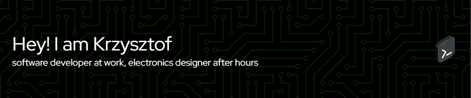

I have been passionate about computers since childhood and began programming in elementary school. 
After completing technical school, I started working as a game programmer. 
Almost a decade of my life went by in this field, but recently I have shifted my focus towards automation testing software. 
Additionally, I have developed an interest in designing electronics and programming my own devices.

## 📍 I was born in Bydgoszcz...
Bydgoszcz is a medium-sized city located in the northern part of Poland. The city is situated on the Brda River, while the district I come from is located on the Vistula River, which is the longest river in Poland.

## 👀 I am interested in the following areas...
- PCB design
- Game development
- Electrical engineering

## 🌱 I am currently learning...
- Electronics design
- Software architecture patterns
- Modern C++ features
- Large language models

## 💞️ I like...
- Being active
- Road cycling
- Engaging in useful projects 

## 📫 If you require my skills, let me know...
- [Facebook](https://www.facebook.com/krzysztof.strehlau)
- [LinkedIn](https://www.linkedin.com/in/krzysztofstrehlau/)
- [Hackaday](https://hackaday.io/projects/hacker/385266)
